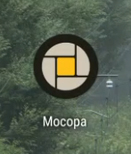
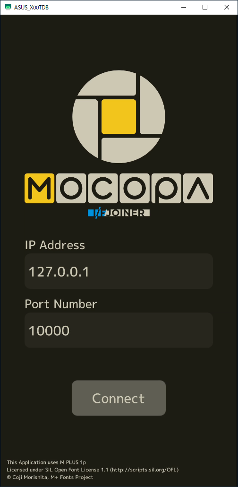
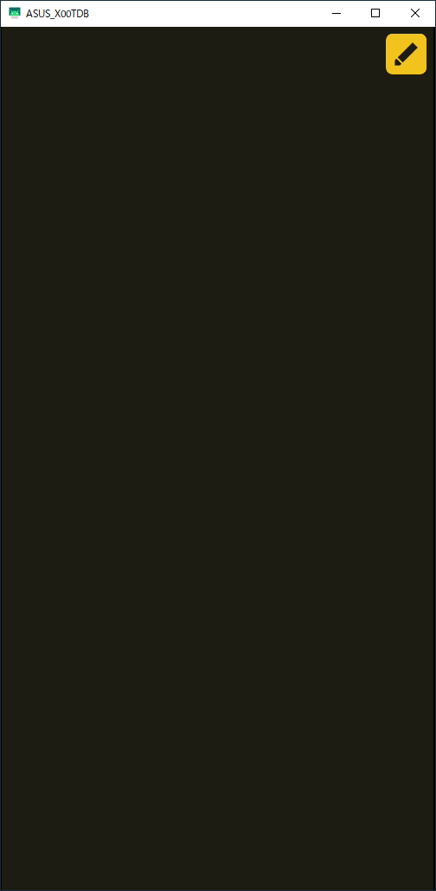
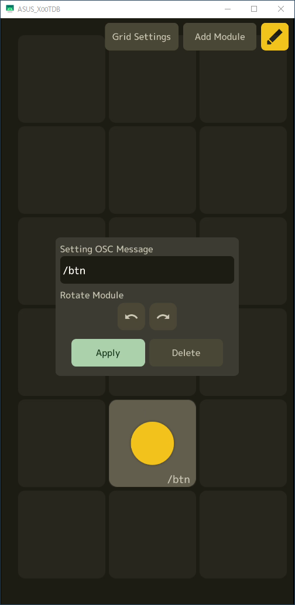
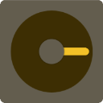

# Mocopa

Android端末をBlenderを操作するための入力デバイスとして使用するためのアプリです．

Blender用アドオン[I/F Joiner](https://github.com/simasimataiyo/IFJoiner)との使用を推奨します．
> 
# Feature

- OSCによるPCとの通信
  
- 5種類のモジュール（ボタン・トグルスイッチ・スライダー・ロータリエンコーダ・ジョイスティック）を画面上へ自由に配置
- Mocopa用物理モジュールと併せて使うことで物理コントローラに（物理モジュールの3Dプリント用データはそのうち公開予定）
- Android 9.0で動作確認（おそらくAndroid 5.1以上で動作するはず）
  

# Install

Android端末で[Releases Page](https://github.com/simasimataiyo/Mocopa/releases)にアクセスし，.apkファイルをダウンロードしてください．

「ファイル」アプリでMocopa.apkをタップするとインストールが始まります．

提供元不明のアプリのインストールとなります．使用は自己責任でお願いします．

# How to use
BlenderにI/F Joinerをインストールしていることを前提に解説します．

## Blenderとの接続
> Android端末がBlenderを起動しているPCと同じLANに接続している必要があります．
このアプリを使用する際は必ずWi-Fiの接続と接続先を確認してください．

アプリを起動すると上の画面が表示されます．

IP AddressにはBlenderが起動しているPCのIPアドレスを，Port NumberにはI/F Joinerのサーバ設定のPort Numberと同じ値を入力します．

「Connect」をタップするとコントローラー画面に移動します．

> 「Connect」をタップしても画面が切り替わらない時はIP AddressとPort Numberに誤りがないか確認してみてください．

## コントローラの編集

初期状態のコントローラ画面です．
右上のペンボタンをタップすると，コントローラ画面の編集モードに移行しグリッドタイルが表示されます．

### グリッドの設定

初回起動時は始めにグリッドの設定を行うことをおすすめします．

「Grid Settings」をタップするとGridの設定メニューが開きます．設定できる項目は以下の通りです.
- Module Size
  - モジュールの最小サイズは**20mm×20mm**になり，これを1とした時の拡大率を指定します．
物理モジュールを使用する際には大きさがぴったりになるように微調整してください．

- Column Count
  - グリッドの列の本数を指定します．
- Row Count
  - グリッドの行の本数を指定します．
- Position
  - グリッドの位置を調整します．

### モジュールの配置

「Add Modules」をタップするとモジュールの一覧が表示されます．

使いたいモジュールをタップすると画面中央に配置されます．配置されたモジュールをドラッグして位置を変更します．グリッドタイルの上に重なると自動でスナップします．

### 各モジュールの編集

編集モード中にモジュールをタップするとモジュールの設定メニューが表示されます．
- Settings OSC Message
  - 選択したモジュールからOSCメッセージを送信する際のアドレスパターンを入力します．
- Rotate Module
  - 90度ずつ右か左回りに回転します．
  
編集したら必ず「Apply」をタップしてください．

コントローラ画面の編集が完了したら右上のペンボタンをタップして編集モードを終了します．

配置したモジュールをタップしたりドラッグしたりするとOSCメッセージが送信されるはずです．

# Modules
各モジュールの概要と送信するOSCメッセージを解説します．

## Button

### 概要
モーメンタリ型のボタンです．キーボードのキーと同じような使い方ができます．
### OSCメッセージ
- 指が触れた時
  - ( /address_pattern, 1.0 )
- 指を離したとき
  - ( /address_pattern, 0.0 )
  
## Toggle

### 概要
オルタネート型のトグルスイッチ（波動スイッチ？）です．True or Falseの入力に使うのがよさそうです．

### OSCメッセージ
- ONにしたとき
  - ( /address_pattern, 1.0 )
- OFFにしたとき
  - ( /address_pattern, 0.0 )
  
## Slider

### 概要
スライダーです．黄色い円状のノブをドラッグしている間，常にノブの位置に応じて0.0～1.0の範囲で値を送信します．

### OSCメッセージ
- ノブをタップしたとき
  - ( /address_pattern, knob_position(0.0～1.0) )
- ノブをドラッグしている間
  - ( /address_pattern, knob_position(0.0～1.0) )
  
## Rotary Encoder

### 概要
角度センサです．黄色い針をドラッグして角度(-180～180), 回転量（ひとつ前のOSCメッセージを送信したときの角度との差），モジュールの状態を送信します．
ロータリスイッチとしても使用できそうです．

### OSCメッセージ
- 針に触れたとき
  - ( /address_pattern, Angle(-180.0～180.0), 0.0, 1.0 )
- 針のドラッグ開始時
  - ( /address_pattern, Angle(-180.0～180.0), 0.0, 2.0 )
- 針をドラッグしている間
  - ( /address_pattern, Angle(-180.0～180.0), delta_angle(-180.0～180.0), 0.0 )
- 針のドラッグ終了時
  - ( /address_pattern, Angle(-180.0～180.0), delta_angle(-180.0～180.0), 3.0 )
- 針から指を離したとき
  - ( /address_pattern, Angle(-180.0～180.0), 0.0, 4.0 )

## Joystick

### 概要
ジョイスティックです．黄色い円状のスティックをドラッグしている間，角度(-180～180)，モジュール中心とスティックとの距離（0.0～1.0）,モジュールの状態を送信します．

### OSCメッセージ
- スティックに触れたとき
  - ( /address_pattern, Angle(-180.0～180.0), distance(0.0～1.0), 1.0 )
- スティックのドラッグ開始時
  - ( /address_pattern, Angle(-180.0～180.0), distance(0.0～1.0), 2.0 )
- スティックをドラッグしている間
  - ( /address_pattern, Angle(-180.0～180.0), distance(0.0～1.0), 0.0 )
- スティックのドラッグ終了時
  - ( /address_pattern, Angle(-180.0～180.0), distance(0.0～1.0), 3.0 )
- スティックから指を離したとき
  - ( /address_pattern, Angle(-180.0～180.0), distance(0.0～1.0), 4.0 )
  
特殊な挙動として，距離が0.2になった瞬間にだけ送信するメッセージがあります．
- ひとつ前に送信した距離 ≦ 0.2 ≦ 現在の距離 のとき
  - ( /address_pattern, Angle(-180.0～180.0), distance(0.0～1.0), 5.0 )
- 現在の距離 ≦ 0.2 ≦ ひとつ前に送信した距離 のとき 
  - ( /address_pattern, Angle(-180.0～180.0), distance(0.0～1.0), 6.0 )
  

# Others
Unity 2019.4.29f1で開発しています．

# Credits
使用しているUnity Package
- [OSCJack](https://github.com/keijiro/OscJack)

使用しているフォント
- [M PLUS 1p](https://fonts.google.com/specimen/M+PLUS+1p)
  - Licensed under SIL OPEN FONT LICENSE Version 1.1 
  - Designed by Coji Morishita, M+ Fonts Project